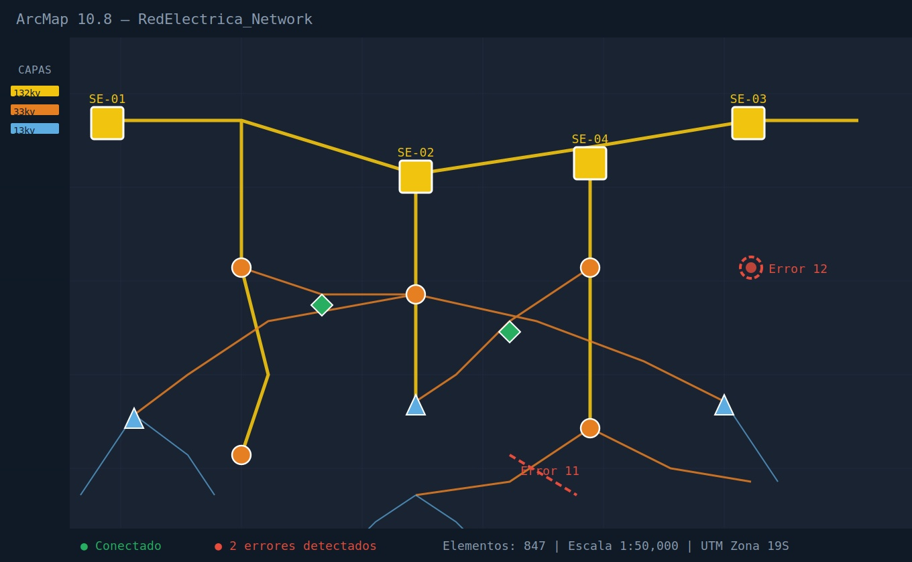
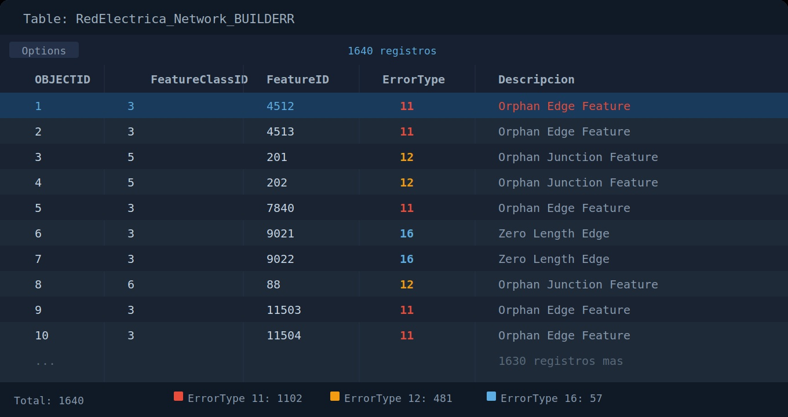

# ⚡ Electrical Network Modeling — GIS

<p align="center">
  
  
  
  
  
</p>

<p align="center">
GIS workflow focused on electrical network modeling, connectivity validation, topology QA/QC and Geometric Network analysis using ArcGIS.
</p>

---

This project demonstrates:
- Electrical network spatial modeling
- Geometric Network construction
- Connectivity validation
- Topology analysis
- Spatial QA/QC
- Attribute normalization
- Error detection and correction
- GIS data management workflows

---

## 🔌 Geometric Network Overview

Visualization of the electrical infrastructure modeled inside ArcGIS Geometric Network, including connectivity relationships between edges and junction elements.

<p align="center">
  
</p>

---

## ⚡ BUILDERR Validation Table

Connectivity validation results generated from BUILDERR, showing disconnected features, orphan elements and topology correction workflows.

<p align="center">
  
</p>

---

## 🗂️ Data Model Components

| Feature Class | Geometry Type | Network Role |
|---|---|---|
| Electrical Lines (LE) | Polyline | Edge |
| Substations | Point | Junction |
| Reclosers | Point | Junction |
| Switches | Point | Junction |
| Sectionalizers | Point | Junction |
| Capacitor Banks | Point | Junction |
| Transformation Points | Point | Junction |

> All feature classes are stored inside a Feature Dataset within a File Geodatabase (.gdb) using a shared projected coordinate system.

---

## ⚙️ Workflow

```text
Source Data
(CAD / field survey / tables)
        │
        ▼
┌─────────────────────┐
│ Geometry Editing    │
│ Attribute Editing   │
└────────┬────────────┘
         │
         ▼
┌─────────────────────┐
│ Geometric Network   │
│ Construction        │
└────────┬────────────┘
         │
         ▼
┌─────────────────────┐
│ Connectivity        │
│ Validation          │
└────────┬────────────┘
         │
         ▼
┌─────────────────────┐
│ QA / QC             │
│ Spatial Validation  │
└────────┬────────────┘
         │
         ▼
┌─────────────────────┐
│ Final GIS Delivery  │
│ Data Standardization│
└─────────────────────┘
```

---

## 🔌 Build Errors Detected and Resolved

| ErrorType | Description | Corrective Action |
|---|---|---|
| **11** | Orphan Edge Feature — line with no connected node at either end | Re-edit trace, snap to equipment |
| **12** | Orphan Junction Feature — equipment not associated to any line | Verify position, re-digitize |
| **16** | Zero Length Edge — line with zero length | Delete and re-digitize correctly |

---

## 🧹 Data Quality Control

**Validations performed:**
- Geometry — Repair Geometry, multipart detection, duplicate vertices
- Attributes — empty fields, out-of-domain values, incorrect data types
- Nomenclature — line and equipment identifier standardization
- Topological consistency — lines without nodes, equipment outside LE coverage
- Logical connectivity — network flow verification, isolated elements

**Tools used:**
```
ArcGIS Pro / ArcMap
├── Repair Geometry
├── Find Identical / Delete Identical
├── Check Geometry
├── Topology Rules (Feature Dataset)
├── Utility Network Analyst
└── Field Calculator (Python expressions)
```

---

## 🛠️ Tech Stack

| Tool | Usage |
|---|---|
| **ArcGIS Pro / ArcMap 10.8** | Editing, modeling, network analysis |
| **ArcCatalog** | GDB and Feature Dataset management |
| **arcpy (Python)** | Validation automation and exports |
| **SQL** | Attribute queries and inconsistency detection |
| **Excel / Power BI** | Quality reports and correction tracking |

---

## 📁 Repository Structure

```
gis-electrical-network-modeling/
│
├── README.md
├── .gitignore
│
├── assets/
│   └── screenshots/
│       ├── 01-geometric-network-view.jpg
│       └── 02-builderr-table.jpg
│
├── docs/
│   ├── workflow-edicion.md
│   └── error-types-geometric-network.md
│
└── scripts/
    └── export_disconnected.py
```

---

## 🧠 Key Learnings

- Structuring GIS data models for energy infrastructure networks
- Deep understanding of network topology and its geometric requirements
- QC/QA methodology applied to critical spatial data
- Coordination with field teams to validate GIS data against real operations
- Reproducible workflows for editing, validation and data delivery

---

## 👩‍💻 Author

**Denise Hernández**  
GIS Analyst | Spatial Data | Network Analysis  
[](https://www.linkedin.com/in/denise-hern%C3%A1ndez-a3071968/)
[](https://quickest-stream-2d8.notion.site/Portafolio-GIS-Denise-Hern%C3%A1ndez-3069dd2d2c5781cd9539e5bdc0ba14fe?pvs=74)
